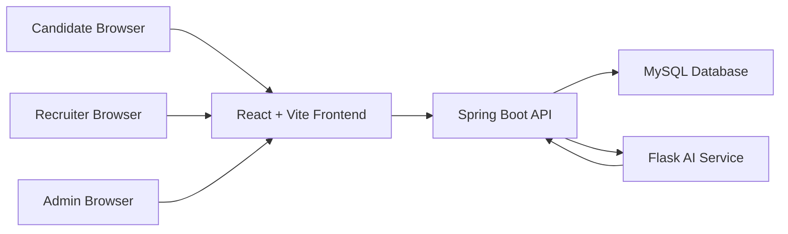
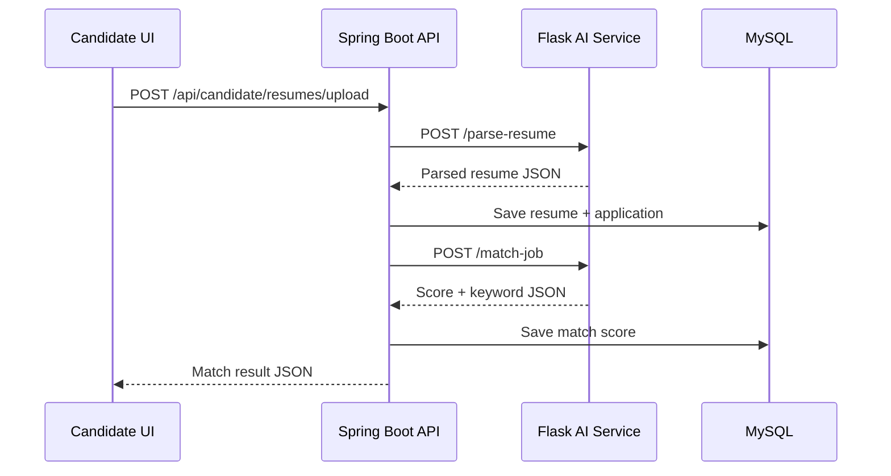
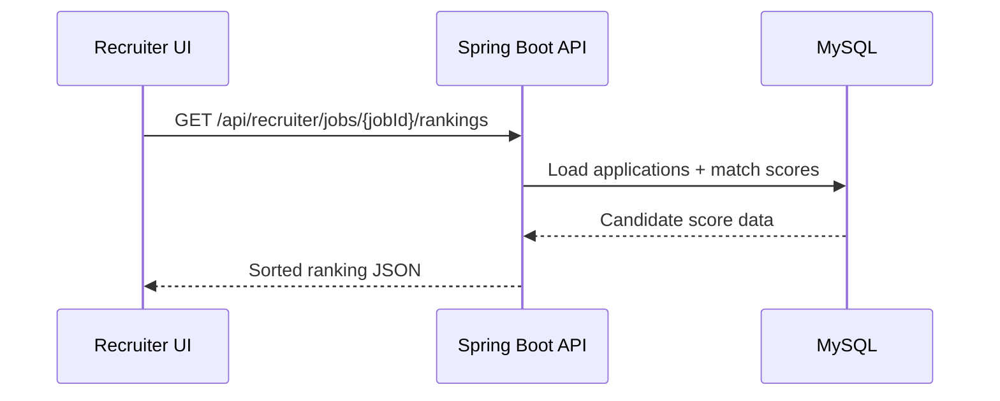

# Architecture

## Overview

The platform is split into independently deployable services inside a single monorepo. The frontend owns user experience, the backend owns authentication, persistence, and orchestration, the AI service owns resume parsing and matching, and MySQL owns durable recruitment data.

## Services

### Frontend

Path: `frontend/`

Responsibilities:

- Render public, auth, candidate, recruiter, and admin pages.
- Store JWT token in browser local storage.
- Call Spring Boot APIs with `Authorization: Bearer <token>`.
- Upload resume files using multipart form data.
- Display candidate match scores and recruiter ranking analytics.

Stack:

- React
- Vite
- Tailwind CSS
- React Router
- Axios

### Backend

Path: `backend/`

Responsibilities:

- Register and authenticate users.
- Issue and validate JWT tokens.
- Persist users, jobs, resumes, applications, and match scores.
- Accept candidate resume uploads.
- Call Flask `/parse-resume` and `/match-job`.
- Return candidate rankings to recruiters and admins.

Stack:

- Spring Boot
- Spring Web
- Spring Security
- Spring Data JPA
- MySQL Connector/J
- JJWT

### AI Service

Path: `ai-service/`

Responsibilities:

- Extract text from PDF resumes.
- Extract simple contact details and keywords.
- Compare resume text with job descriptions.
- Return JSON-only AI responses.

Stack:

- Flask
- pdfplumber
- spaCy
- scikit-learn
- Gunicorn

### Database

Path: `database/`

Responsibilities:

- Store platform identity and recruitment data.
- Enforce relational integrity between users, jobs, applications, resumes, and match scores.

Core tables:

- `users`
- `jobs`
- `resumes`
- `applications`
- `match_scores`
- `notifications`

## Resume Matching Flow

## Recruiter Ranking Flow

## Security Model

- Public endpoints: registration, login, health checks.
- Protected endpoints require JWT bearer authentication.
- Candidate-only endpoints require `CANDIDATE`.
- Recruiter ranking endpoints require `RECRUITER` or `ADMIN`.
- Passwords are stored using BCrypt.
- JWT signing secret is configured through environment variables.

## Deployment Shape

Each service can be deployed independently:

- `frontend`: static web host or Node/Vite container
- `backend`: JVM container
- `ai-service`: Python/Gunicorn container
- `database`: managed MySQL or MySQL container

The included `docker-compose.yml` describes the intended local development topology.
