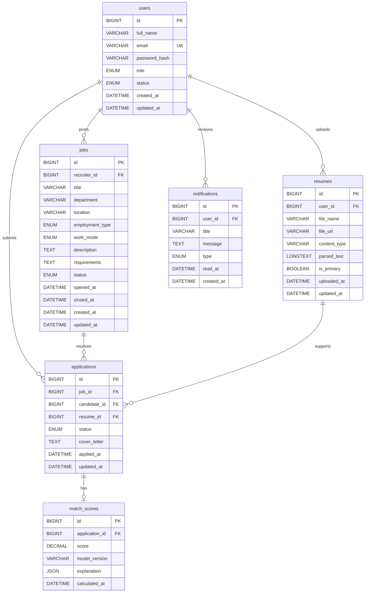

# Database ER Relationship

## Relationship Summary

- One recruiter user can post many jobs.
- One candidate user can upload many resumes.
- One candidate user can submit many applications.
- One job can receive many applications.
- One resume can support many applications.
- One application can have one match score.
- One user can receive many notifications.
